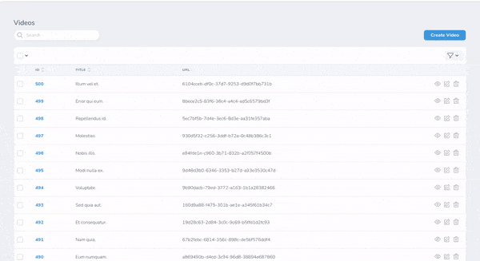

# Nova Resizable

[](https://packagist.org/packages/optimistdigital/nova-resizable)
[](https://packagist.org/packages/optimistdigital/nova-resizable)

This [Laravel Nova](https://nova.laravel.com/) package allows you to resize resource table columns.

## Preview




## Installation

Install the package in to a Laravel app that uses [Nova](https://nova.laravel.com/) via composer:
```bash
composer require optimistdigital/nova-resizable
```

## Credits

- [Kaspar Rosin](https://github.com/kasparrosin)

## License
Nova Resizable is open-sourced software licensed under the [MIT license](LICENSE.md).
